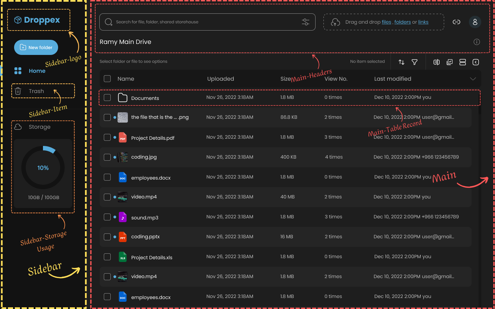

[Deployed](https://droppex-rawa-assignment.vercel.app/)🚀
# Droppex Rawa Assignment <sup>[Design](./docs/design.png)</sup> <sup style="font-size: smaller;">[Requirement](https://github.com/Ak-ram/droppex_rawa_assignment/assets/69124951/aea489b0-3ed2-43da-a045-a347c6e98a2b)</sup>


> Created using Canva.

### 1. First Head
The layout depicted above can be dissected into two primary sections:

1. **Sidebar Block**: This section encompasses essential components facilitating navigation and information display.
   
   - **Logo**: Represents the visual identity of the application.
   - **Sidebar Items**: Navigation elements aiding users in accessing various sections of the application.
   - **Storage Usage UI**: Provides insightful data on the utilization of storage resources.

2. **Main Page Block**: This segment constitutes crucial elements for user interaction and data presentation.

   - **Header**: The topmost section serving as a navigational anchor and providing contextual information.
   - **File/Folders Table List**: A structured representation facilitating the management and organization of files and folders.

To gain a clearer understanding of the layout's structure and organizational hierarchy, please refer to the image provided below.

---

## 2. Assignment Requirements 📝

#### Achieving the Requirements ✅
- **CSS and HTML Design**: Implemented using semantic HTML5 tags and CSS for styling.
- **Arabic and English Language Support**: Utilized language attributes and proper Unicode encoding to ensure compatibility with both languages.
- **Responsive Design**: Employed media queries and flexible layouts to ensure optimal viewing experience across devices.
  
## 3. Issues and Challenges 🛠️

#### Challenges Faced 🤔
- **RTL (Right-to-Left) Language Support**: Challenges in implementing proper alignment and layout for Arabic text.
- **Deployment to GitHub Pages**: Faced a challenge where SVG files deployed to GitHub Pages were interpreted with MIME type text/html instead of svg+xml.

## 4. Solutions Implemented 💡
- **RTL Language Support**: Implemented CSS techniques such as `direction: rtl;` and `text-align: right;` to ensure proper alignment and readability for Arabic text, and this css trick to simulate click actions
- ```css
  #english:checked ~ * .content-wrapper [lang="en"],
  #arabic:checked ~ * .content-wrapper [lang="ar"]
  ```
- After encountering challenges with GitHub Pages, the decision was made to migrate the project to Vercel, which provided a smoother deployment experience and resolved the SVG MIME type issue.


## 5. Touches to Enhance Design 🎨
- **Auto show/hide Sidbar**: Implemented hover effects and transitions to improve user experience.
